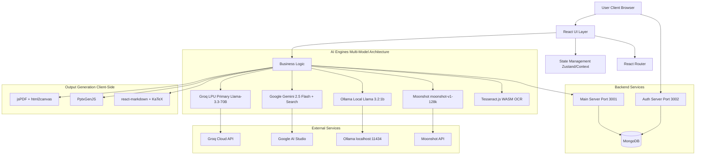

# DeepHubAI Turbo - Design Document

## 1. System Architecture

### 1.1 Overview

DeepHubAI Turbo is architected as a modern, high-performance Single Page Application (SPA). It emphasizes client-side processing to ensure responsiveness and privacy. The core architecture revolves around a modular component system where each AI tool functions as an independent module within a unified shell.

### 1.2 High-Level Diagram



## 2. Technology Stack

### 2.1 Frontend Core

- **Framework:** React 18 (TypeScript) - robust, type-safe UI development.
- **Build Tool:** Vite - for lightning-fast development and optimized production builds.
- **Routing:** React Router DOM - seamless client-side navigation.

### 2.2 UI & Styling

- **CSS Framework:** Tailwind CSS - utility-first styling for rapid UI development.
- **Component Library:** Radix UI - unstyled, accessible UI primitives for modals, dropdowns, etc.
- **Icons:** Lucide React - consistent, lightweight iconography.
- **Animations:** Framer Motion & GSAP - for fluid, engaging user interactions.

### 2.3 State Management

- **Global State:** Zustand / React Context - efficient state handling across components.
- **Data Fetching:** TanStack Query - managing server state and caching.

### 2.4 AI & Processing (Multi-Model Architecture)

- **Primary Inference:** **Groq SDK** - Leveraging LPU™ Inference Engine with Llama-3.3-70B-Versatile for ultra-low latency (approx 300 tokens/sec).
- **Fallback & Search:** **Google Gemini 2.5 Flash** - High-context window model with native Google Search grounding tool for real-time information retrieval.
- **Local Intelligence:** **Ollama** - Running Llama 3.2:1b locally for privacy-preserving, deep research tasks without internet dependency.
- **Extended Context:** **Moonshot/Kimi** - moonshot-v1-128k model for extended context windows.
- **Fallback Chain:** Groq → Gemini → Ollama (automatic switching on rate limits/failures)
- **OCR:** **Tesseract.js** - WASM-based client-side Optical Character Recognition.
- **Mathematics:** KaTeX / Rehype-Katex - rendering complex mathematical formulas.
- **PDF Parsing:** pdf-parse (Primary) + pdfjs-dist (Fallback) - extracting text from uploaded PDFs with "Double-Safety" dual-engine architecture and chunking strategy (6000 char chunks).

### 2.5 Document Generation

- **PDF:** jsPDF & html2canvas - generating high-quality PDF reports and papers client-side.
- **PPT:** PptxGenJS - creating native PowerPoint presentations with title slides, content slides, table slides, comparison slides, and speaker notes.
- **Markdown:** react-markdown with remark-math and rehype-katex for LaTeX math rendering.

### 2.6 Backend Services

- **Main Server:** Node.js + Express + TypeScript (Port 3001)
  - API routes for AI tools, file processing, library management
  - Multer for file uploads (10MB limit)
  - pdf-parse for PDF text extraction
  - Sharp for image processing
- **Auth Server:** Node.js + Express (Port 3002)
  - JWT authentication with 7-day expiry
  - bcrypt password hashing (salt rounds: 10)
  - User registration and login endpoints
- **Database:** MongoDB with Mongoose
  - User model: username, email, password (hashed), role, createdAt
  - Library storage for saved content

## 3. Component Architecture

### 3.1 Core Components

#### 3.1.1 Dashboard Component

- **Purpose:** Central hub for accessing all AI tools
- **Props:** `tools: ToolConfig[]`, `onToolSelect: (toolId: string) => void`
- **State:** `selectedTool: string | null`, `recentActivity: Activity[]`
- **Responsibilities:**
  - Render tool cards with icons and descriptions
  - Handle tool selection and navigation
  - Display recent activity history
  - Manage theme toggle

#### 3.1.2 Tool Container Component

- **Purpose:** Wrapper for individual AI tool interfaces
- **Props:** `toolId: string`, `config: ToolConfig`
- **State:** `inputData: Record<string, any>`, `isProcessing: boolean`, `result: any`
- **Responsibilities:**
  - Render tool-specific input forms
  - Manage tool state and validation
  - Coordinate with AI service layer
  - Handle export operations

#### 3.1.3 AI Service Manager

- **Purpose:** Orchestrate AI model selection and failover
- **Interface:**
  ```typescript
  interface AIServiceManager {
    generateContent(
      prompt: string,
      options: GenerationOptions,
    ): Promise<string>;
    selectProvider(
      provider: "auto" | "groq" | "gemini" | "ollama" | "moonshot",
    ): void;
    getAvailableProviders(): ProviderInfo[];
    handleFailover(error: APIError): Promise<string>;
  }
  ```
- **Responsibilities:**
  - Attempt Groq inference first (Llama-3.3-70B-Versatile)
  - Failover to Gemini 2.5 Flash on error/rate-limit (with Google Search grounding)
  - Route to Ollama (Llama 3.2:1b) for local processing
  - Route to Moonshot (moonshot-v1-128k) for extended context
  - Handle API errors gracefully with user-friendly messages
  - Maintain conversation context across provider switches

#### 3.1.4 Export Service

- **Purpose:** Handle document generation and export
- **Interface:**
  ```typescript
  interface ExportService {
    exportToPDF(content: string, options: PDFOptions): Promise<Blob>;
    exportToPPTX(slides: SlideData[], options: PPTXOptions): Promise<Blob>;
    exportToMarkdown(content: string): string;
    exportToJSON(data: any): string;
    copyToClipboard(content: string): Promise<void>;
  }
  ```
- **PPTX Features:**
  - Title slides with branding
  - Content slides with detailed paragraphs
  - Table slides with headers and rows
  - Comparison slides with side-by-side content
  - Speaker notes for each slide

### 3.2 Tool-Specific Components

Each AI tool follows this structure:

- Input form component with validation
- Preview component for generated content with Markdown/LaTeX rendering
- Export controls component (PDF, PPTX, Markdown, JSON, Clipboard)
- Tool-specific state management
- File upload support (where applicable)

**Implemented Tools:**

1. **LessonPlanBuilder.tsx** - Structured lesson plan generation
2. **HomeworkCreator.tsx** - Homework with answer keys
3. **Question Paper Generator.tsx** - Question papers with file upload and "Target Chapter" extraction logic
4. **PaperSolver.tsx** - Paper solving with chunking strategy
5. **ReportCardAssistant.tsx** - Report card comments with vision support
6. **PPTGenerator.tsx** - PowerPoint slide generation
7. **DocumentSecretary.tsx** - Professional institutional document drafting with A4 layout
8. **QuizShuffler.tsx** - Quiz version shuffling
9. **TurboAnalytics.tsx** - High-performance neural analytics dashboard

## 4. Data Flow & Fallback Strategy

### 4.1 Request Flow

1.  **Input:** User interacts with a specific tool (e.g., Lesson Plan Builder) via the UI.
2.  **Validation:** Input data is validated client-side before processing.
3.  **Processing:** Input data is structured and formatted for AI consumption.
4.  **Inference Orchestration:**
    - **Attempt 1:** Request sent to **Groq** (Llama-3.3-70B-Versatile) for immediate response.
    - **Failover:** If Groq rate-limits (429) or fails, the request automatically reroutes to **Gemini 2.5 Flash** with Google Search grounding.
    - **Extended Context:** If user selects Moonshot, request routes to moonshot-v1-128k for extended context windows.
    - **Deep Mode:** If user selects "Deep Research" or "Ollama", request routes to `localhost:11434` for processing via local Llama 3.2:1b.
    - **Target Chapter:** For Question Generation, specific chapters are extracted via smart segmentation before AI injection.
    - **Vision/OCR:** Image/PDF uploads are processed locally via Tesseract.js WASM to extract text before LLM injection.
    - **Chunking:** Large documents are split into 6000 char chunks to prevent token overflow.
5.  **Response Handling:** The AI response is received, parsed (Markdown/JSON), and stored in the local state.
6.  **Rendering:** The UI updates to display the generated content with LaTeX math rendering via KaTeX.
7.  **Export:** User selects an export format, and the client-side libraries (jsPDF/PptxGenJS) generate the downloadable file.
8.  **Library:** User can save generated content to MongoDB library for later retrieval.

### 4.2 Error Handling Strategy

```typescript
interface ErrorHandler {
  handleAPIError(error: APIError): UserFacingError;
  handleNetworkError(error: NetworkError): UserFacingError;
  handleValidationError(error: ValidationError): UserFacingError;
}
```

**Error Categories:**

- **Rate Limit (429):** Automatic failover to backup model
- **Network Error:** Retry with exponential backoff (max 3 attempts)
- **Validation Error:** Display inline error messages
- **Model Unavailable:** Suggest alternative model or local processing

## 5. API Contracts

### 5.1 Backend API Endpoints

#### 5.1.1 Main Server (Port 3001)

**Chat Endpoint:**

```typescript
POST /api/chat
Request: {
  message: string
  provider?: 'auto' | 'groq' | 'gemini' | 'ollama' | 'moonshot'
  conversationHistory?: Message[]
  enableWebSearch?: boolean
}
Response: {
  response: string
  provider: string
  tokensUsed?: number
}
```

**Lesson Plan Generation:**

```typescript
POST /api/lesson-plan/generate
Request: {
  topic: string
  gradeLevel: string
  subject: string
  duration: string
}
Response: {
  lessonPlan: {
    title: string
    objectives: string[]
    materials: string[]
    procedure: string[]
    assessment: string[]
  }
}
```

**Question Paper Generation:**

```typescript
POST /api/question-paper/generate
Content-Type: multipart/form-data
Request: {
  topic: string
  totalMarks: number
  blueprint: string
  file?: File (PDF/TXT)
}
Response: {
  questionPaper: {
    questions: Question[]
    markingScheme: string
  }
}
```

**Paper Solver:**

```typescript
POST /api/solve-paper
Content-Type: multipart/form-data
Request: {
  file: File (PDF/Image)
  subject?: string
}
Response: {
  solutions: {
    question: string
    solution: string
    steps: string[]
  }[]
}
```

**Library Management:**

```typescript
POST /api/library/save
Request: {
  title: string
  type: string
  content: any
}

GET /api/library/
Response: {
  items: LibraryItem[]
}

DELETE /api/library/:id
Response: {
  success: boolean
}
```

#### 5.1.2 Auth Server (Port 3002)

**User Registration:**

```typescript
POST / api / auth / signup;
Request: {
  username: string;
  email: string;
  password: string;
}
Response: {
  message: string;
  userId: string;
}
```

**User Login:**

```typescript
POST /api/auth/login
Request: {
  email: string
  password: string
}
Response: {
  token: string (JWT, 7-day expiry)
  user: {
    id: string
    username: string
    email: string
    role: string
  }
}
```

### 5.2 Groq API Integration

```typescript
interface GroqRequest {
  model: string; // "llama-3.3-70b-versatile"
  messages: Message[];
  temperature?: number;
  max_tokens?: number;
  stream?: boolean;
}

interface GroqResponse {
  id: string;
  choices: {
    message: {
      role: string;
      content: string;
    };
    finish_reason: string;
  }[];
  usage: {
    prompt_tokens: number;
    completion_tokens: number;
    total_tokens: number;
  };
}
```

### 5.2 Gemini API Integration

```typescript
interface GeminiRequest {
  contents: Content[];
  generationConfig?: {
    temperature?: number;
    maxOutputTokens?: number;
  };
  safetySettings?: SafetySetting[];
}

interface GeminiResponse {
  candidates: {
    content: {
      parts: { text: string }[];
    };
    finishReason: string;
  }[];
}
```

### 5.3 Ollama Local API

```typescript
interface OllamaRequest {
  model: string; // "llama3.2"
  prompt: string;
  stream?: boolean;
  options?: {
    temperature?: number;
    num_predict?: number;
  };
}

interface OllamaResponse {
  model: string;
  response: string;
  done: boolean;
}
```

## 6. State Management Design

### 6.1 Global State (Zustand/Context)

```typescript
interface AppState {
  // Theme
  theme: "light" | "dark";
  setTheme: (theme: "light" | "dark") => void;

  // AI Provider Selection
  selectedProvider: "auto" | "groq" | "gemini" | "ollama" | "moonshot";
  setSelectedProvider: (
    provider: "auto" | "groq" | "gemini" | "ollama" | "moonshot",
  ) => void;

  // Tool State
  activeTool: string | null;
  setActiveTool: (toolId: string | null) => void;

  // History
  recentActivity: Activity[];
  addActivity: (activity: Activity) => void;

  // Library
  libraryItems: LibraryItem[];
  addToLibrary: (item: LibraryItem) => void;
  removeFromLibrary: (id: string) => void;
}
```

### 6.2 Tool-Specific State

Each tool maintains its own local state using React hooks:

- Input form data
- Validation errors
- Processing status
- Generated results
- Export options

## 7. Security & Privacy

### 7.1 API Key Management

- **Storage:** Environment variables (`.env` file)
  - GROQ_API_KEY
  - GEMINI_API_KEY
  - MOONSHOT_API_KEY (optional)
  - JWT_SECRET
  - MONGODB_URI
  - OLLAMA_BASE_URL (default: http://localhost:11434)
- **Access:** Server-side only, never exposed to client
- **Rotation:** Support for key rotation without code changes

### 7.2 Data Privacy

- **Client-Side Processing:** OCR (Tesseract.js WASM), PDF generation (jsPDF), and PPT creation (PptxGenJS) occur entirely in browser
- **Local Mode:** Ollama integration (Llama 3.2:1b) ensures sensitive data never leaves user's machine
- **No Logging:** User inputs and generated content are not logged on backend
- **Ephemeral Processing:** API requests are processed and discarded, not stored
- **MongoDB Security:** User passwords hashed with bcrypt (salt rounds: 10)
- **JWT Security:** 7-day token expiration with secure signing

### 7.3 Secure Communication

- **HTTPS Only:** All API communication over encrypted connections
- **CORS Configuration:** Strict CORS policies for API endpoints
- **Input Sanitization:** All user inputs sanitized before processing
- **File Upload Validation:** Size limits (10MB PDF, 5MB images) and format validation
- **LaTeX Safety:** Double-backslash handling for JSON safety

## 8. Performance Optimization

### 8.1 Code Splitting

- Lazy load tool components
- Dynamic imports for heavy libraries (jsPDF, PptxGenJS)
- Route-based code splitting

### 8.2 Caching Strategy

- Cache AI model responses for identical inputs (session-based)
- Service worker for offline capability
- Browser caching for static assets

### 8.3 Bundle Optimization

- Tree shaking for unused code
- Minification and compression
- Asset optimization (images, fonts)

## 9. Correctness Properties

### 9.1 AI Response Properties

**Property 1: Response Completeness**

- For any valid input, the AI service must return a non-empty response or a well-defined error
- **Validates:** Requirements 2.3.1, 3.3.1

**Property 2: Failover Consistency**

- If primary model fails, failover to secondary model must occur within 2 seconds
- **Validates:** Requirements 2.3.1, 3.1.1

**Property 3: Model Selection Idempotency**

- Selecting the same model multiple times produces consistent behavior
- **Validates:** Requirements 2.3.1

### 9.2 Export Properties

**Property 4: Export Format Validity**

- All exported PDFs must be valid PDF format (parseable by standard readers)
- **Validates:** Requirements 2.3.4

**Property 5: Export Content Preservation**

- Content exported to any format must match the displayed content (no data loss)
- **Validates:** Requirements 2.3.4

**Property 6: Export Filename Validity**

- Generated filenames must be valid for all major operating systems
- **Validates:** Requirements 2.3.4

### 9.3 Input Validation Properties

**Property 7: Input Sanitization**

- All user inputs must be sanitized before processing (no script injection)
- **Validates:** Requirements 3.2.1

**Property 8: File Size Limits**

- System must reject files exceeding specified size limits with clear error messages
- **Validates:** Requirements 2.3.3

**Property 9: File Format Validation**

- System must only accept specified file formats and reject others gracefully
- **Validates:** Requirements 2.3.3

### 9.4 UI State Properties

**Property 10: Theme Persistence**

- Theme selection must persist across browser sessions
- **Validates:** Requirements 2.2.4

**Property 11: Navigation State Preservation**

- Navigating between tools must preserve unsaved input data
- **Validates:** Requirements 2.2.2

**Property 12: Loading State Consistency**

- UI must always show loading indicator during async operations
- **Validates:** Requirements 3.4.4

### 9.5 Error Handling Properties

**Property 13: Error Recovery**

- System must recover from any error without requiring page refresh
- **Validates:** Requirements 3.3.5

**Property 14: Error Message Clarity**

- All error messages must be actionable and user-friendly (no technical jargon)
- **Validates:** Requirements 3.4.3

**Property 15: Graceful Degradation**

- System must function offline for local features when internet is unavailable
- **Validates:** Requirements 3.3.3

## 10. Testing Strategy

### 10.1 Property-Based Testing

Use **fast-check** library for property-based testing in TypeScript:

```typescript
import fc from "fast-check";

// Example: Test AI Service failover property
fc.assert(
  fc.property(fc.string(), async (prompt) => {
    const service = new AIServiceManager();
    const result = await service.generateContent(prompt, { timeout: 5000 });
    return result !== null && result !== undefined;
  }),
);
```

### 10.2 Unit Testing

- Test individual components in isolation
- Mock AI service responses
- Validate input/output transformations

### 10.3 Integration Testing

- Test AI service failover mechanism
- Test export pipeline end-to-end
- Test file upload and OCR processing

### 10.4 E2E Testing

- Test complete user workflows for each tool
- Validate cross-browser compatibility
- Test responsive design breakpoints

## 11. UI/UX Strategy

### 11.1 Visual Identity

- **Color Palette:** Modern "Turbo" aesthetic with primary brand colors
- **Typography:** Clear, readable fonts optimized for educational content
- **Glassmorphism:** Subtle glass effects for modern, clean appearance
- **Spacing:** Consistent spacing system (8px base unit)

### 11.2 Responsive Design

- **Desktop (1920px+):** Full-featured layout with side navigation
- **Tablet (768px-1919px):** Adapted layout with collapsible navigation
- **Touch Targets:** Minimum 44x44px for all interactive elements

### 11.3 Feedback Mechanisms

- **Loading States:** Skeleton screens during content generation
- **Toast Notifications:** Success/error messages for user actions
- **Progress Indicators:** Show AI processing progress
- **Tooltips:** Contextual help for all features

### 11.4 Accessibility

- **ARIA Labels:** Proper labeling for screen readers
- **Keyboard Navigation:** Full keyboard support for all features
- **Color Contrast:** WCAG AA compliance for text contrast
- **Focus Indicators:** Clear focus states for interactive elements

## 12. Deployment & Infrastructure

### 12.1 Build Process

- **Development:** `npm run dev` - Vite dev server with HMR
- **Production:** `npm run build` - Optimized production bundle
- **Preview:** `npm run preview` - Preview production build locally

### 12.2 Environment Configuration

```env
# API Keys
GROQ_API_KEY=your_groq_key
GEMINI_API_KEY=your_gemini_key
MOONSHOT_API_KEY=your_moonshot_key

# Ollama Configuration
OLLAMA_BASE_URL=http://localhost:11434

# MongoDB
MONGODB_URI=mongodb://localhost:27017/deephubai

# JWT
JWT_SECRET=your_jwt_secret

# Feature Flags
ENABLE_OLLAMA=true
ENABLE_OCR=true
ENABLE_WEB_SEARCH=true
```

### 12.3 Hosting

- **Static Hosting:** Deploy to Vercel, Netlify, or similar
- **CDN:** Serve static assets via CDN for global performance
- **SSL:** HTTPS enforced for all deployments

## 13. Future Enhancements

- **Collaborative Features:** Real-time collaboration on lesson plans
- **Template Library:** Pre-built templates for common educational tasks
- **Analytics Dashboard:** Track usage patterns and popular tools
- **Mobile App:** Native mobile applications for iOS/Android
- **Voice Input:** Speech-to-text for hands-free content generation
- **Batch Processing:** Process multiple documents simultaneously
- **Custom Model Fine-tuning:** Fine-tune models on institution-specific data
- **Integration APIs:** Webhooks and REST APIs for third-party integrations
- **Advanced OCR:** Support for more languages and handwriting styles
- **Offline Mode:** Full offline functionality with local models
